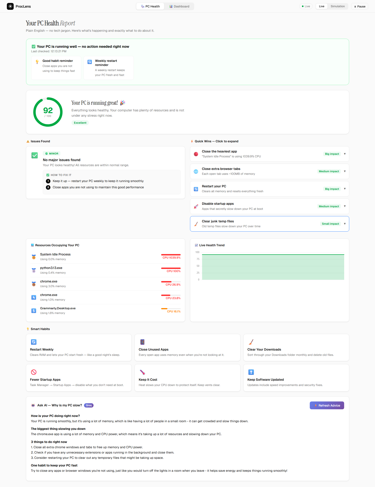
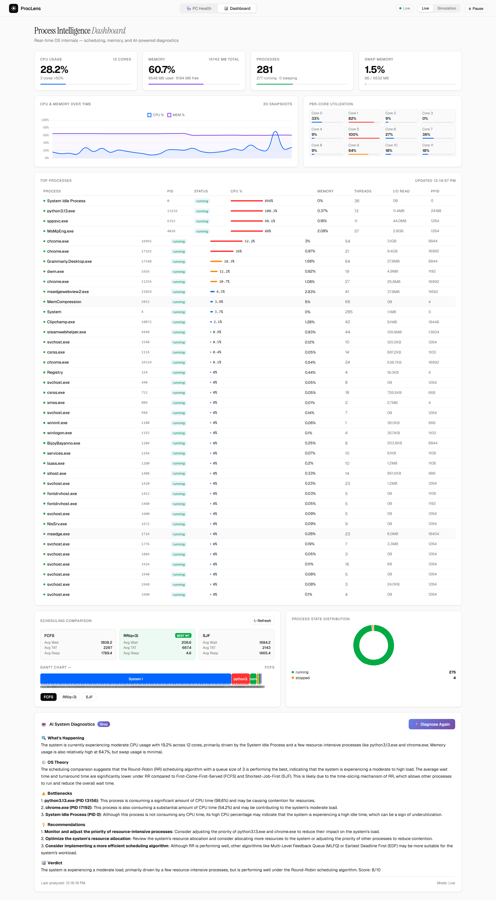

[README (1.md](https://github.com/user-attachments/files/27409119/README.1.md)
<div align="center">


<br/><br/>

# 🔬 ProcLens

### *Your computer finally explains itself.*

**Real-time OS process intelligence — live scheduling simulation, AI diagnostics, and plain-English health reports for everyone.**

<br/>

[🚀 Get Started](#-quick-start)
&nbsp;·&nbsp;
[✨ Features](#-features)
&nbsp;·&nbsp;
[🧠 OS Concepts](#-os-concepts-demonstrated)
&nbsp;·&nbsp;
[📸 Screenshots](#-screenshots)

</div>

---

## 💡 What is ProcLens?

Most people have no idea why their computer is slow. Task Manager shows numbers but tells you nothing. Textbooks teach OS theory but never connect it to a real machine.

**ProcLens bridges that gap.**

It reads live data directly from your OS kernel, applies real CPU scheduling algorithms to your actual running processes, and uses AI to explain what's happening — whether you're a CS student, a developer, or someone who just wants their PC to run faster.

> 💬 *Not a simulation. Not fake data. Your real computer, finally explained.*

---

## 📸 Screenshots

<table>
  <tr>
    <td align="center" width="50%">
      
      <br/>
      <b>🩺 PC Health Tab</b>
      <br/>
      <sub>Plain-English diagnostics with live health score, smart fix cards, and AI-powered advice — no jargon</sub>
    </td>
    <td align="center" width="50%">
      
      <br/>
      <b>📊 Process Intelligence Dashboard</b>
      <br/>
      <sub>Live CPU/memory metrics, per-core utilization, Gantt chart, and real-time scheduling comparison</sub>
    </td>
  </tr>
</table>

---

## ✨ Features

### 🩺 PC Health Tab — For Everyone

| Feature | Description |
|---|---|
| 🎯 **Live Health Score** | 0–100 score updating every 2 seconds |
| 📝 **Plain English Diagnostics** | No jargon, no technical terms |
| 🃏 **Smart Problem Cards** | Every issue comes with numbered fix steps |
| ⚡ **Clickable Quick Wins** | Expand any card to see exactly what to do, with action buttons |
| 📈 **Live Health Trend Chart** | See how your PC performance changes over time |
| 🚨 **Real-Time Alert Banner** | Pops up the moment performance drops — tells you exactly why |

### 📊 Dashboard Tab — For the Technical Audience

| Feature | Description |
|---|---|
| 🖥️ **Live System Metrics** | CPU usage per core, memory, swap, and full process table |
| ⚙️ **Scheduling Comparison** | FCFS, SJF, and Round Robin run simultaneously on your actual processes |
| 📊 **Interactive Gantt Chart** | Switch between algorithms and see how each schedules your workload |
| 🍩 **State Distribution Chart** | Process state breakdown in a real-time donut chart |
| 📋 **Full Process Table** | CPU%, memory, threads, I/O, PID, PPID — all live |

### 🤖 AI Diagnostics — Powered by Groq (LLaMA 3.1)

| Mode | Description |
|---|---|
| 😊 **Friendly Mode** | Talks like a helpful friend — tells you exactly what to close and why |
| 🔬 **Technical Mode** | Explains using OS theory: scheduling, thrashing, context switching, I/O wait |

> Both modes analyse your **live snapshot**, not a generic answer.

---

## 🧠 OS Concepts Demonstrated

| Concept | Where You See It |
|---|---|
| **CPU Scheduling** (FCFS, SJF, RR) | Scheduling comparison + Gantt chart |
| **Process States** | Process table + state distribution chart |
| **Memory Pressure & Thrashing** | Memory metrics + AI diagnostics |
| **Context Switching** | AI explanation engine |
| **I/O-bound vs CPU-bound processes** | Process table + resource hog ranking |
| **Virtual Memory & Swap** | Swap metrics + problem cards |

---

## 🚀 Quick Start

**1. Clone the repo**
```bash
git clone https://github.com/nirnoy-charisma/proclens.git
cd proclens
```

**2. Install dependencies**
```bash
pip install -r requirements.txt
```

**3. Add your API key**

Open `config.py` and add your [Groq API key](https://console.groq.com) (free, no credit card needed):
```python
GROQ_API_KEY = "your-key-here"
```

**4. Run**
```bash
python app.py
```

**5. Open your browser**
```
http://localhost:5000
```

---

## 🗂 Project Structure

```
proclens/
├── app.py                  # Flask server + all API routes
├── config.py               # API keys and settings
├── requirements.txt
├── engine/
│   ├── collector.py        # Live OS data collection via psutil
│   ├── scheduler.py        # FCFS, SJF, Round Robin engines
│   └── explainer.py        # Groq AI integration
└── templates/
    └── index.html          # Full dashboard UI (single file)
```

---

## 🔌 API Endpoints

| Method | Endpoint | Description |
|---|---|---|
| `GET` | `/api/snapshot` | Live system snapshot |
| `GET` | `/api/compare` | Run all 3 scheduling algorithms |
| `POST` | `/api/explain` | AI technical diagnosis |
| `POST` | `/api/explain_friendly` | AI plain-English advice |
| `GET` | `/api/history` | Historical CPU/memory data |

---

## 🛠 Tech Stack

| Layer | Technology |
|---|---|
| **Backend** | Python 3, Flask |
| **OS Data** | psutil (cross-platform) |
| **Scheduling Engine** | Custom Python — FCFS, SJF, Round Robin |
| **AI** | Groq API — LLaMA 3.1 8B Instant |
| **Frontend** | HTML, CSS, Vanilla JavaScript |
| **Charts** | Chart.js |

---

## 🌍 Platform Support

| OS | Status |
|---|---|
| Windows 10/11 | ✅ Fully supported |
| macOS | ✅ Fully supported |
| Linux | ✅ Fully supported |

---

## 👤 Author

Built by **Nirnoy Charisma** as an Operating Systems course project.

*If you found this useful, leave a ⭐ — it helps more than you think.*

---

<div align="center">

<sub>Built with 🐍 Python · ⚡ Flask · 🖥️ psutil · 📊 Chart.js · 🤖 Groq AI</sub>

</div>
